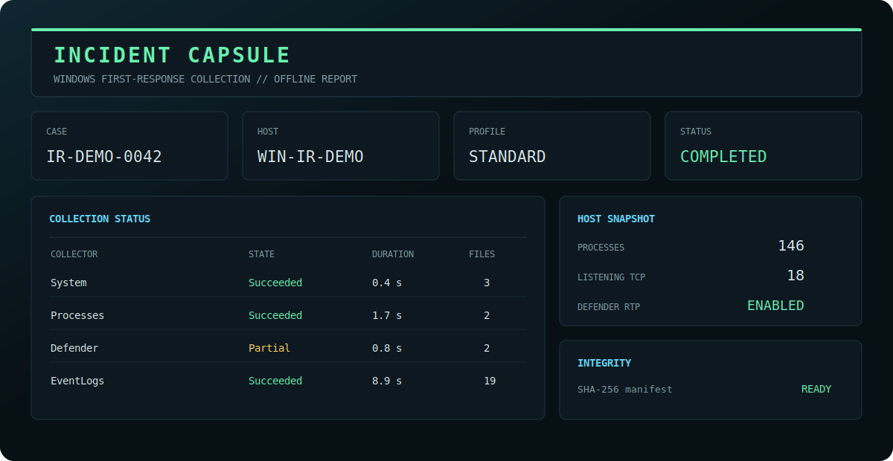

# Incident Capsule

[](https://github.com/xGreeny/incident-capsule/actions/workflows/ci.yml)
[](https://github.com/xGreeny/incident-capsule)
[](LICENSE)

```text
┌──────────────────────────────────────────────────────────────┐
│ INCIDENT CAPSULE // WINDOWS FIRST-RESPONSE COLLECTION       │
│ acquire locally · report offline · verify with SHA-256      │
└──────────────────────────────────────────────────────────────┘
```

**Incident Capsule is a local, read-only Windows first-response collector that packages volatile host state, security configuration, selected event logs, and integrity metadata into a reviewable evidence bundle.**

It is built for the first minutes of an investigation: gather a defensible snapshot, understand what was collected, preserve failures instead of hiding them, and hand the result to the next analyst without requiring a web service or proprietary backend.



## What it produces

A Standard collection creates an evidence directory and a ZIP archive:

```text
IC_IR-2026-0042_WS-042_20260712T184233Z_a1b2c3d4/
├── analysis/
│   ├── timeline.csv
│   └── timeline.json
├── evidence/
│   ├── certificates/
│   ├── defender/
│   ├── devices/
│   ├── drivers/
│   ├── events/
│   │   ├── evtx/
│   │   └── summaries/
│   ├── execution/
│   ├── hotfixes/
│   ├── identities/
│   ├── network/
│   ├── persistence/
│   ├── powershell/
│   ├── processes/
│   ├── scheduled-tasks/
│   ├── security/
│   ├── services/
│   ├── sessions/
│   ├── software/
│   ├── storage/
│   └── system/
├── logs/
│   └── collector.log
├── metadata/
│   ├── capsule.json
│   ├── coverage.json
│   ├── manifest.json
│   └── manifest.sha256
└── report/
    └── index.html

IC_IR-2026-0042_WS-042_20260712T184233Z_a1b2c3d4.zip
IC_IR-2026-0042_WS-042_20260712T184233Z_a1b2c3d4.zip.sha256
IC_IR-2026-0042_WS-042_20260712T184233Z_a1b2c3d4.zip.verification.json
```

The report is self-contained and opens offline. JSON files use a common evidence envelope and remain the canonical structured evidence; large tabular datasets can also receive spreadsheet-safe CSV views. `coverage.json` makes missing, partial, skipped, and successful acquisition explicit. The bounded timeline is a derived navigation index with links back to source evidence, not a separate source or a security verdict. Every file in the capsule is listed in a SHA-256 manifest. The ZIP receives a separate sidecar checksum and an external machine-readable verification receipt after safe extraction and embedded-manifest verification.

## Quick start

Open an elevated PowerShell session when the response procedure permits it. Non-elevated execution is supported, but protected event channels and parts of the security configuration can be unavailable.

The module is published to the PowerShell Gallery:

```powershell
Install-Module IncidentCapsule -Scope CurrentUser
Invoke-IncidentCapsule -OutputPath 'C:\IR\Cases' -CaseId 'IR-2026-0042' -Profile Standard
```

For a downloaded release, keep the ZIP and its `.sha256` sidecar together, verify the hash, and run the launcher from the extracted package:

```powershell
$archive = '.\incident-capsule-1.2.0.zip'
$expectedHash = ((Get-Content "$archive.sha256" -Raw).Trim() -split '\s+')[0]
$actualHash = (Get-FileHash $archive -Algorithm SHA256).Hash
if ($actualHash -ne $expectedHash) { throw 'Release checksum mismatch.' }

Expand-Archive $archive -DestinationPath .\incident-capsule-release
Set-Location .\incident-capsule-release\incident-capsule-1.2.0
.\Invoke-IncidentCapsule.ps1 -OutputPath 'C:\IR\Cases' -CaseId 'IR-2026-0042'
```

The release is self-contained: its launcher loads `IncidentCapsule/IncidentCapsule.psd1` from the extracted package. A source checkout remains supported as well:

```powershell
git clone https://github.com/xGreeny/incident-capsule.git
Set-Location .\incident-capsule

Import-Module .\src\IncidentCapsule\IncidentCapsule.psd1 -Force

$readiness = Test-IncidentCapsuleReadiness `
    -OutputPath 'C:\IR\Cases' `
    -Profile Standard
$readiness | Format-List Status,IsElevated,OutputPath,PrivacyScope,ResourceLimits
$readiness.Checks | Where-Object Status -ne 'Passed'

$result = Invoke-IncidentCapsule `
    -OutputPath 'C:\IR\Cases' `
    -CaseId 'IR-2026-0042' `
    -Profile Standard

$result | Format-List
Start-Process $result.ReportPath
```

Verify the directory or archive before analysis or transfer:

```powershell
Test-IncidentCapsuleIntegrity -Path $result.WorkingDirectory
Test-IncidentCapsuleIntegrity -Path $result.ArchivePath -RequireSidecar
```

A single-file workflow can remove the working directory after a verified archive has been created:

```powershell
Invoke-IncidentCapsule `
    -OutputPath 'E:\Evidence' `
    -CaseId 'IR-2026-0042' `
    -Profile Standard `
    -RemoveWorkingDirectory
```

## Collection profiles

| Profile | Intended use | Data scope | Capsule budget | EVTX/channel | Timeline |
|---|---|---|---:|---:|---:|
| `Minimal` | Fast, minimized triage | Minimized | 1 GiB | No export / 64 MiB cap | 2,000 |
| `Standard` | Default first-response package | Full | 5 GiB | 256 MiB | 10,000 |
| `Extended` | Deeper host review | Full | 20 GiB | 1 GiB | 50,000 |

Inspect the effective profile before collecting:

```powershell
Get-IncidentCapsuleProfile
Get-IncidentCapsuleProfile -Name Extended | Format-List *
```

## Evidence collectors

| Collector | Primary evidence | Elevation impact |
|---|---|---|
| `System` | OS, hardware, boot time, clock, time zone, Secure Boot, TPM, execution identity | Some firmware data can be unavailable |
| `Storage` | Disks, volumes, shares, BitLocker state | BitLocker details can require elevation |
| `Processes` | PID/PPID, image path, owner, command line, start time, optional image hash/signature | Other-user details improve with elevation |
| `Services` | State, start mode, account, binary path, process ID | Usually low |
| `Network` | Interfaces, addresses, routes, TCP/UDP endpoints, DNS, neighbor cache, inbox command output | Some owning-process data improves with elevation |
| `Sessions` | Interactive sessions, logon-session metadata, loaded profiles | Usually low |
| `LocalAccounts` | Local users, groups, and memberships | Group enumeration can be partial on hardened systems or domain controllers |
| `ScheduledTasks` | Task metadata, actions, triggers, principals, last/next run, optional XML | Protected task XML can require elevation |
| `Persistence` | Run keys, Winlogon values, startup folders, IFEO debugger values, WMI subscriptions | Other-user hives must already be loaded |
| `Defender` | Platform status, preferences, exclusions, ASR state, recent detections | Some preference and threat data can require elevation |
| `PowerShell` | Engine versions, execution policy, logging policy, modules, profile metadata | History content is deliberately not collected |
| `SecurityConfiguration` | Audit policy, firewall state/rules, UAC, RDP, Device Guard, local security policy, AppLocker | Several sources require elevation |
| `Hotfixes` | QFE records and bounded Windows Update history | Update history depends on Windows Update interfaces |
| `Drivers` | System drivers, optional signed PnP inventory, `driverquery` output | Usually low |
| `EventLogs` | Bounded summaries and optional native EVTX exports from curated channels | Security and protected channels require elevation |
| `InstalledSoftware` | Installed-software inventory from machine and loaded per-user uninstall registry keys | Usually low; per-user hives must already be loaded |
| `Certificates` | Local-machine root, intermediate, publisher, people, and disallowed trust stores | Usually low |
| `ExecutionArtifacts` | Bounded prefetch copies, raw AppCompatCache export, BAM records, decoded UserAssist entries | Prefetch access requires elevation; prefetch can be disabled on servers |
| `Devices` | USB storage history, mounted devices, per-user mount points, portable devices, bounded `setupapi.dev.log` | Usually low |

The complete output contract and caveats are in [Collector reference](docs/collector-reference.md).

## Scope controls

Run only selected collectors:

```powershell
Invoke-IncidentCapsule `
    -OutputPath 'C:\IR\Cases' `
    -CaseId 'IR-2026-0042' `
    -Collectors System,Processes,Network,Defender,EventLogs
```

Or remove specific collectors from a profile:

```powershell
Invoke-IncidentCapsule `
    -OutputPath 'C:\IR\Cases' `
    -CaseId 'IR-2026-0042' `
    -Profile Standard `
    -ExcludeCollector Drivers,Hotfixes
```

A PowerShell data file can override bounded settings and channel selection without executing arbitrary configuration code:

```powershell
Invoke-IncidentCapsule `
    -OutputPath 'C:\IR\Cases' `
    -CaseId 'IR-2026-0042' `
    -Profile Standard `
    -ConfigurationPath .\examples\config.privacy-conscious.psd1
```

See [Configuration](docs/configuration.md) and the ready-to-use files in [`examples/`](examples/).

## Integrity model

Incident Capsule separates acquisition from verification:

1. collectors write bounded evidence beneath a unique capsule root;
2. timeline, structured coverage, and the offline report are generated;
3. `capsule.json` is written last and logging is closed;
4. every file except the manifest files themselves is hashed with SHA-256;
5. `manifest.json` and `manifest.sha256` are written and the frozen directory is verified;
6. the directory is archived and receives a sidecar SHA-256 checksum;
7. the archive is safely extracted and independently verified, including its sidecar and embedded manifest, before optional source-directory removal;
8. a `.zip.verification.json` receipt is written beside the archive.

`Test-IncidentCapsuleIntegrity` checks missing, modified, and unexpected files and validates `manifest.sha256` against the JSON manifest. Archive verification rejects unsafe paths, reparse or symbolic-link metadata, duplicate or case-colliding entries, and excessive entry count, expanded size, or compression ratio before extraction, then verifies the embedded manifest. Use `-RequireSidecar` at handoff boundaries so a missing adjacent checksum fails verification.

```powershell
$verification = Test-IncidentCapsuleIntegrity -Path 'E:\Evidence\IC_IR-2026-0042_WS-042_20260712T184233Z_a1b2c3d4.zip' -RequireSidecar
$verification | Format-List
$verification.FileResults | Where-Object Status -ne 'Valid'
```

### Manifest signing

Checksums alone cannot prove who sealed a capsule: an actor with write access can replace evidence and recalculate every hash. An organizational code-signing certificate closes that gap. When `-SigningCertificate` is supplied, the checksum list receives a detached CMS signature `metadata/manifest.sha256.p7s` that travels inside the capsule and the archive, and the built-in archive verification requires it:

```powershell
Invoke-IncidentCapsule `
    -OutputPath 'E:\Evidence' `
    -CaseId 'IR-2026-0042' `
    -SigningCertificate '2E9C4F6A0B1D8E3C5A7F9B2D4E6C8A0F1B3D5E7C'

Test-IncidentCapsuleIntegrity -Path $result.ArchivePath -RequireSidecar -RequireSignature
```

Cryptographic validity and certificate-chain trust are reported separately, so verification works offline and with internal CAs. Protect the signing key like any other incident-response credential.

## SIEM export

`Export-IncidentCapsuleData` flattens the structured evidence envelopes of a collected capsule into line-delimited JSON for Splunk, Sentinel, Timesketch, and similar tooling. Every line carries capsule ID, host, collector, capture time, and the capsule-relative source file next to the unmodified record. The export is written beside the capsule, never into it:

```powershell
$export = Export-IncidentCapsuleData -Path $result.WorkingDirectory
$export | Format-List

Export-IncidentCapsuleData -Path $result.WorkingDirectory -Collector Processes,Network -DestinationPath 'E:\Evidence\network-triage.jsonl'
```

## Safety properties

Incident Capsule is intentionally constrained:

- local collection only; no remote execution or lateral discovery;
- no process termination, containment, remediation, quarantine, or configuration change;
- no event-log clearing;
- no memory acquisition or full-disk imaging;
- no browser-history or PowerShell-history content collection;
- no active port scanning;
- bounded capsule size, EVTX files, native-command runtime/output, event queries, executable hashing, configuration values, high-volume inventories, derived timeline, and archive verification;
- atomic JSON, CSV, and text writes plus spreadsheet-formula neutralization in CSV exports;
- collector failures are recorded and do not erase successful evidence;
- all reports work offline and load no external scripts, fonts, or telemetry.

The collector is **not** a replacement for memory forensics, disk imaging, EDR acquisition, or a formal chain-of-custody process. It is a transparent first-response snapshot. Preserve original evidence and follow the authority, retention, and handling requirements of your organization.

## Sensitive data warning

A capsule can contain usernames, group membership, process command lines, IP addresses, domain information, event messages, policy settings, Defender exclusions, share names, and software inventory. Treat it as incident evidence:

- collect only on systems you are authorized to examine;
- write to an access-controlled and preferably encrypted destination;
- transfer through an approved secure channel;
- verify hashes before and after transfer;
- do not attach real capsules to public GitHub issues;
- review [Evidence handling](docs/evidence-handling.md) before operational use.

## Architecture


More detail is available in [Architecture](docs/architecture.md) and [Threat model](docs/threat-model.md).

## Requirements

- Windows PowerShell 5.1 or PowerShell 7 on Windows.
- Windows client or Windows Server with CIM/WMI and the inbox management interfaces available for the selected collectors.
- Administrative elevation is recommended for the Standard and Extended profiles, but it is not forced.
- Sufficient free space for EVTX exports and the duplicate archive when compression is enabled.

## Development and release validation

```powershell
Install-Module Pester -RequiredVersion 5.9.0 -Scope CurrentUser -Force -SkipPublisherCheck
Install-Module PSScriptAnalyzer -RequiredVersion 1.25.0 -Scope CurrentUser -Force

./build.ps1 -Task Analyze
./build.ps1 -Task Test
./build.ps1 -Task Package
```

`Package` creates the ZIP and SHA-256 sidecar, verifies the checksum, extracts the ZIP into a fresh temporary directory, and exercises both the packaged module and launcher in Windows PowerShell 5.1 and PowerShell 7. CI performs this package test on pull requests and `main`, in addition to running Pester in both editions. Tags matching `v*` must match the manifest/runtime/changelog version and produce immutable, provenance-attested release assets.

## Documentation

- [Architecture](docs/architecture.md)
- [Collector reference](docs/collector-reference.md)
- [Configuration](docs/configuration.md)
- [Readiness and safe handoff](docs/readiness-and-handoff.md)
- [Evidence handling](docs/evidence-handling.md)
- [Threat model](docs/threat-model.md)
- [Troubleshooting](docs/troubleshooting.md)
- [Synthetic report sample](docs/sample-report.html)

## License

Incident Capsule is released under the [MIT License](LICENSE).
