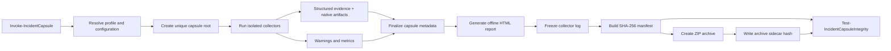

# Incident Capsule

[](https://github.com/xGreeny/incident-capsule/actions/workflows/ci.yml)
[](https://github.com/xGreeny/incident-capsule)
[](LICENSE)

```text
┌──────────────────────────────────────────────────────────────┐
│ INCIDENT CAPSULE // WINDOWS FIRST-RESPONSE COLLECTION       │
│ acquire locally · report offline · verify with SHA-256      │
└──────────────────────────────────────────────────────────────┘
```

**Incident Capsule is a local, read-only Windows first-response collector that packages volatile host state, security configuration, selected event logs, and integrity metadata into a reviewable evidence bundle.**

It is built for the first minutes of an investigation: gather a defensible snapshot, understand what was collected, preserve failures instead of hiding them, and hand the result to the next analyst without requiring a web service or proprietary backend.


## What it produces

A Standard collection creates an evidence directory and a ZIP archive:

```text
IC_IR-2026-0042_WS-042_20260712T184233Z/
├── evidence/
│   ├── defender/
│   ├── drivers/
│   ├── events/
│   │   ├── evtx/
│   │   └── summaries/
│   ├── hotfixes/
│   ├── identities/
│   ├── network/
│   ├── persistence/
│   ├── powershell/
│   ├── processes/
│   ├── scheduled-tasks/
│   ├── security/
│   ├── services/
│   ├── sessions/
│   ├── storage/
│   └── system/
├── logs/
│   └── collector.log
├── metadata/
│   ├── capsule.json
│   ├── manifest.json
│   └── manifest.sha256
└── report/
    └── index.html

IC_IR-2026-0042_WS-042_20260712T184233Z.zip
IC_IR-2026-0042_WS-042_20260712T184233Z.zip.sha256
```

The report is self-contained and opens offline. JSON files use a common evidence envelope; large tabular datasets also receive CSV exports. Every file in the capsule is listed in a SHA-256 manifest. The ZIP receives a separate sidecar checksum.

## Quick start

Open an elevated PowerShell session when the response procedure permits it. Non-elevated execution is supported, but protected event channels and parts of the security configuration can be unavailable.

```powershell
git clone https://github.com/xGreeny/incident-capsule.git
Set-Location .\incident-capsule

Import-Module .\src\IncidentCapsule\IncidentCapsule.psd1 -Force

$result = Invoke-IncidentCapsule `
    -OutputPath 'C:\IR\Cases' `
    -CaseId 'IR-2026-0042' `
    -Profile Standard

$result | Format-List
Start-Process $result.ReportPath
```

Verify the directory or archive before analysis or transfer:

```powershell
Test-IncidentCapsuleIntegrity -Path $result.WorkingDirectory
Test-IncidentCapsuleIntegrity -Path $result.ArchivePath
```

A single-file workflow can remove the working directory after a verified archive has been created:

```powershell
Invoke-IncidentCapsule `
    -OutputPath 'E:\Evidence' `
    -CaseId 'IR-2026-0042' `
    -Profile Standard `
    -RemoveWorkingDirectory
```

## Collection profiles

| Profile | Intended use | Event lookback | EVTX export | Executable hashing |
|---|---|---:|---:|---:|
| `Minimal` | Fast triage under time pressure | 12 hours | No | No |
| `Standard` | Default first-response package | 24 hours | Yes | No |
| `Extended` | Deeper host review when time and storage permit | 72 hours | Yes | Yes, bounded |

Inspect the effective profile before collecting:

```powershell
Get-IncidentCapsuleProfile
Get-IncidentCapsuleProfile -Name Extended | Format-List *
```

## Evidence collectors

| Collector | Primary evidence | Elevation impact |
|---|---|---|
| `System` | OS, hardware, boot time, clock, time zone, Secure Boot, TPM, execution identity | Some firmware data can be unavailable |
| `Storage` | Disks, volumes, shares, BitLocker state | BitLocker details can require elevation |
| `Processes` | PID/PPID, image path, owner, command line, start time, optional image hash/signature | Other-user details improve with elevation |
| `Services` | State, start mode, account, binary path, process ID | Usually low |
| `Network` | Interfaces, addresses, routes, TCP/UDP endpoints, DNS, neighbor cache, inbox command output | Some owning-process data improves with elevation |
| `Sessions` | Interactive sessions, logon-session metadata, loaded profiles | Usually low |
| `LocalAccounts` | Local users, groups, and memberships | Group enumeration can be partial on hardened systems or domain controllers |
| `ScheduledTasks` | Task metadata, actions, triggers, principals, last/next run, optional XML | Protected task XML can require elevation |
| `Persistence` | Run keys, Winlogon values, startup folders, IFEO debugger values, WMI subscriptions | Other-user hives must already be loaded |
| `Defender` | Platform status, preferences, exclusions, ASR state, recent detections | Some preference and threat data can require elevation |
| `PowerShell` | Engine versions, execution policy, logging policy, modules, profile metadata | History content is deliberately not collected |
| `SecurityConfiguration` | Audit policy, firewall state/rules, UAC, RDP, Device Guard, local security policy, AppLocker | Several sources require elevation |
| `Hotfixes` | QFE records and bounded Windows Update history | Update history depends on Windows Update interfaces |
| `Drivers` | System drivers, optional signed PnP inventory, `driverquery` output | Usually low |
| `EventLogs` | Bounded summaries and optional native EVTX exports from curated channels | Security and protected channels require elevation |

The complete output contract and caveats are in [Collector reference](docs/collector-reference.md).

## Scope controls

Run only selected collectors:

```powershell
Invoke-IncidentCapsule `
    -OutputPath 'C:\IR\Cases' `
    -CaseId 'IR-2026-0042' `
    -Collectors System,Processes,Network,Defender,EventLogs
```

Or remove specific collectors from a profile:

```powershell
Invoke-IncidentCapsule `
    -OutputPath 'C:\IR\Cases' `
    -CaseId 'IR-2026-0042' `
    -Profile Standard `
    -ExcludeCollector Drivers,Hotfixes
```

A PowerShell data file can override bounded settings and channel selection without executing arbitrary configuration code:

```powershell
Invoke-IncidentCapsule `
    -OutputPath 'C:\IR\Cases' `
    -CaseId 'IR-2026-0042' `
    -Profile Standard `
    -ConfigurationPath .\examples\config.privacy-conscious.psd1
```

See [Configuration](docs/configuration.md) and the ready-to-use files in [`examples/`](examples/).

## Integrity model

Incident Capsule separates acquisition from verification:

1. collectors write evidence beneath a unique capsule root;
2. capsule metadata and the offline report are finalized;
3. logging is closed;
4. every file except the manifest files themselves is hashed with SHA-256;
5. `manifest.json` and `manifest.sha256` are written;
6. the directory is archived;
7. the archive receives a sidecar SHA-256 checksum.

`Test-IncidentCapsuleIntegrity` checks missing, modified, and unexpected files. For archives, it also validates the sidecar when present, extracts into a temporary directory, and verifies the embedded manifest.

```powershell
$verification = Test-IncidentCapsuleIntegrity -Path 'E:\Evidence\IC_IR-2026-0042_WS-042_20260712T184233Z.zip'
$verification | Format-List
$verification.FileResults | Where-Object Status -ne 'Valid'
```

## Safety properties

Incident Capsule is intentionally constrained:

- local collection only; no remote execution or lateral discovery;
- no process termination, containment, remediation, quarantine, or configuration change;
- no event-log clearing;
- no memory acquisition or full-disk imaging;
- no browser-history or PowerShell-history content collection;
- no active port scanning;
- bounded event queries and bounded executable hashing;
- collector failures are recorded and do not erase successful evidence;
- all reports work offline and load no external scripts, fonts, or telemetry.

The collector is **not** a replacement for memory forensics, disk imaging, EDR acquisition, or a formal chain-of-custody process. It is a transparent first-response snapshot. Preserve original evidence and follow the authority, retention, and handling requirements of your organization.

## Sensitive data warning

A capsule can contain usernames, group membership, process command lines, IP addresses, domain information, event messages, policy settings, Defender exclusions, share names, and software inventory. Treat it as incident evidence:

- collect only on systems you are authorized to examine;
- write to an access-controlled and preferably encrypted destination;
- transfer through an approved secure channel;
- verify hashes before and after transfer;
- do not attach real capsules to public GitHub issues;
- review [Evidence handling](docs/evidence-handling.md) before operational use.

## Architecture



More detail is available in [Architecture](docs/architecture.md) and [Threat model](docs/threat-model.md).

## Requirements

- Windows PowerShell 5.1 or PowerShell 7 on Windows.
- Windows client or Windows Server with CIM/WMI and the inbox management interfaces available for the selected collectors.
- Administrative elevation is recommended for the Standard and Extended profiles, but it is not forced.
- Sufficient free space for EVTX exports and the duplicate archive when compression is enabled.

## Development and release validation

```powershell
Install-Module Pester -MinimumVersion 5.5.0 -Scope CurrentUser
Install-Module PSScriptAnalyzer -Scope CurrentUser

./build.ps1 -Task Analyze
./build.ps1 -Task Test
./build.ps1 -Task Package
```

The CI workflow runs static analysis and Pester in both Windows PowerShell 5.1 and PowerShell 7. Tags matching `v*` produce a release ZIP and SHA-256 checksum.

## Documentation

- [Architecture](docs/architecture.md)
- [Collector reference](docs/collector-reference.md)
- [Configuration](docs/configuration.md)
- [Evidence handling](docs/evidence-handling.md)
- [Threat model](docs/threat-model.md)
- [Troubleshooting](docs/troubleshooting.md)
- [Synthetic report sample](docs/sample-report.html)

## License

Incident Capsule is released under the [MIT License](LICENSE).
