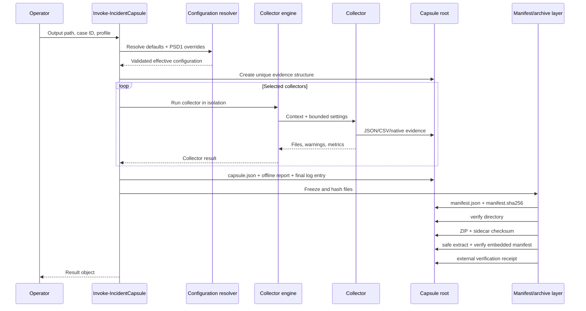

# Architecture

Incident Capsule is a PowerShell module with a strict separation between orchestration, collectors, evidence serialization, reporting, and integrity verification.

## Runtime flow



## Module layout

```text
src/IncidentCapsule/
├── IncidentCapsule.psd1
├── IncidentCapsule.psm1
├── Public/
│   ├── Get-IncidentCapsuleProfile.ps1
│   ├── Invoke-IncidentCapsule.ps1
│   └── Test-IncidentCapsuleIntegrity.ps1
└── Private/
    ├── Collectors.*.ps1
    ├── CollectorEngine.ps1
    ├── Configuration.ps1
    ├── Context.ps1
    ├── IO.ps1
    ├── Manifest.ps1
    └── Report.ps1
```

Private files are dot-sourced in deterministic filename order. Only the three public functions are exported by the module manifest.

## Collector isolation

A collector does not decide whether the whole acquisition succeeds. The engine invokes each selected collector separately, catches terminating failures, records duration and errors, and continues. A collector can therefore have one of four states:

- `Succeeded`: expected evidence was written without warnings.
- `Partial`: useful evidence was written, but one or more sources were unavailable.
- `Failed`: the collector produced no reliable result because of a terminating error.
- `Skipped`: reserved for explicit runtime constraints.

Each collector returns:

```text
OutputFiles  Absolute paths written beneath the capsule root
Warnings     Recoverable limitations, including denied providers or channels
Metrics      Small scalar values for the report; never a substitute for evidence
```

## Evidence envelope

Structured JSON files use a common outer object:

```json
{
  "$schema": "https://raw.githubusercontent.com/xGreeny/incident-capsule/v1.0.1/docs/schemas/collector-envelope.schema.json",
  "schemaVersion": "1.0",
  "capsuleId": "IC-...",
  "collector": "Processes",
  "capturedAtUtc": "2026-07-12T18:42:40.1234567Z",
  "host": "WS-042",
  "data": []
}
```

The envelope keeps source attribution and capture time attached to exported data. JSON is canonical. CSV files are derived spreadsheet-safe views and intentionally contain tabular data only; their corresponding JSON file retains the unchanged envelope.

## Configuration boundary

Configuration files must be PowerShell data files (`.psd1`) and are loaded with `Import-PowerShellDataFile`. They can supply values but cannot execute commands. Unknown collector names and invalid numeric bounds are rejected before the capsule root is created.

The precedence order is:

1. built-in profile;
2. configuration data file;
3. `-Collectors` replacement;
4. `-ExcludeCollector` removal.

## Integrity boundary

The acquisition root is mutable until capsule metadata, report, and collector log are finalized. The final log entry is written before hashing. After that point:

- no collector or report file is modified;
- every non-manifest file receives a SHA-256 entry;
- the archive is built from the frozen root;
- the archive hash is written outside the archive;
- every ZIP entry is path- and budget-validated before extraction;
- the newly created archive is independently verified before source cleanup;
- an external verification receipt records the post-creation result.

This protects against accidental modification and enables transfer verification. It does not provide authenticity against an attacker who can replace both evidence and checksums. See [Threat model](threat-model.md).
